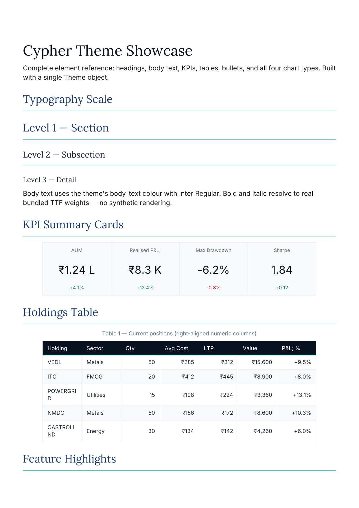
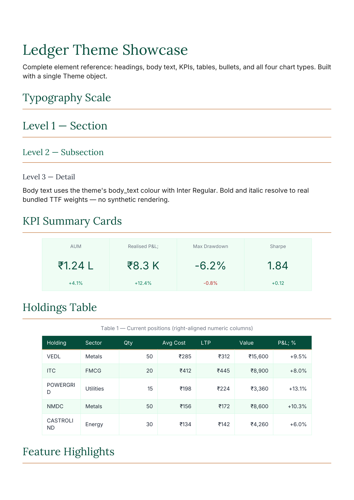
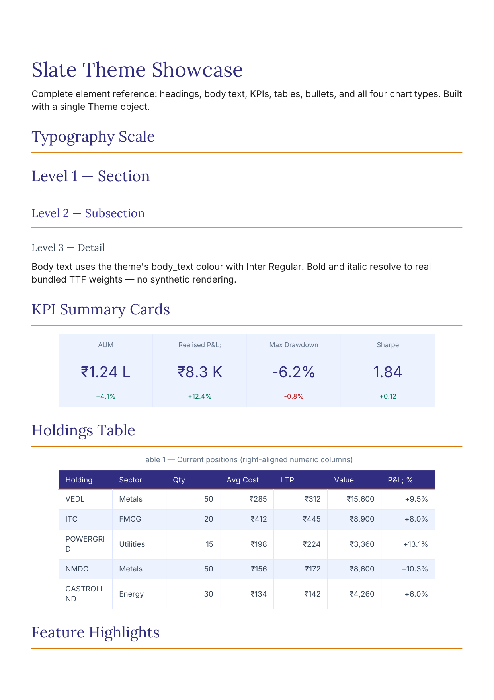

<p align="center">
  <picture>
    <source media="(prefers-color-scheme: dark)" srcset="https://capsule-render.vercel.app/api?type=waving&height=120&color=0:1a1a2e,100:16213e&text=pdf-studio&fontSize=40&fontColor=ffffff&fontAlignY=35">
    
  </picture>
</p>

<p align="center">
  <b>Three lines of code for a PDF with a table, a chart, and a header.</b>
</p>

<p align="center">
  <a href="https://github.com/AshayK003/pdf-studio/blob/master/LICENSE"></a>
  <a href="https://pypi.org/project/pdf-studio/"></a>
  <a href="https://github.com/AshayK003/pdf-studio/actions"></a>
</p>

---

## Why

Every Python developer hits the wall where they need a PDF with actual content — a table, a chart, a header with page numbers — and the options are:

- **ReportLab** — powerful but 300+ lines of `TableStyle` boilerplate for a simple table
- **matplotlib** — great for charts, zero for document layout
- **fpdf2/WeasyPrint** — different tradeoffs, same boilerplate problem
- **Typst** — not Python, not embeddable

**pdf-studio bridges the gap.** It's a thin wrapper around ReportLab that gives you a clean API for the 80% use case: a document with headings, paragraphs, tables, charts, and a running header — in three method calls.

## Architecture

```
┌─────────────┐     ┌──────────────┐     ┌─────────────┐
│  Document   │ ──→ │  render.py   │ ──→ │  ReportLab  │
│  (model)    │     │  (builder)   │     │  (engine)   │
└─────────────┘     └──────────────┘     └─────────────┘
       │                     │
       ▼                     ▼
  Style / Font          SVG → PDF
  (dataclasses)         (svglib)
```

The library has three layers:

1. **Document model** (`Document`, `Style`, `Font`) — pure Python dataclasses that describe *what* goes in the PDF
2. **Render engine** (`render.py`) — converts the document model into ReportLab flowables, handles font registration, table styling, chart conversion (matplotlib SVG → vector PDF via svglib)
3. **ReportLab** — the actual PDF generation. pdf-studio is a 300-line wrapper, not a replacement.

The document is rendered in **two passes**: the first pass counts pages (for `{total}` in headers), the second pass builds the real PDF with resolved page numbers.

## Quick Start

```bash
pip install pdf-studio reportlab matplotlib pandas svglib
```

```python
from pdf_studio import Document

doc = Document(theme="ledger")
doc.set_header("Report | Page {page} of {total}")
doc.add_heading("Q3 Results", level=0)
doc.add_paragraph("Revenue grew 12% year-over-year.")

# Charts from matplotlib (inline vector, no temp files)
import matplotlib.pyplot as plt
fig, ax = plt.subplots()
ax.bar(["Apr", "May", "Jun"], [100, 120, 150])
doc.add_chart(fig)

# Tables from pandas or list-of-lists
import pandas as pd
doc.add_table(pd.DataFrame({
    "City": ["Delhi", "Mumbai", "Bangalore"],
    "Revenue": [450, 620, 380],
}), caption="Q3 Revenue by City")

doc.render("report.pdf")   # ✅ 3 methods, one file
```

That's it. Three methods and one `render()` call produces a multi-page PDF with a running header, a chart, and a styled table.

## Theme Showcase

pdf-studio ships with three research-backed, WCAG-AA verified themes. One `Theme` object recolors the entire document — headings, tables, charts, KPIs, bullets — without touching your code.

| cypher (default) | ledger (finance) | slate (approachable) |
|:---:|:---:|:---:|
|  |  |  |

**Usage:**
```python
from pdf_studio import Document

# Single string — theme applied to everything
doc = Document(theme="ledger")   # or "cypher", "slate"
doc.add_heading("Portfolio Statement", level=0)
doc.add_kpi_row([{"label": "AUM", "value": "₹1.2L", "delta": "+4.1%"}])
doc.add_table([["Holding", "Value"], ["VEDL", "₹15,600"]])
doc.render("report.pdf")
```

Each theme is a complete visual language:
- **cypher** — navy foundation `#0B1121`, teal accent `#2DD4BF`. The brand default.
- **ledger** — deep-green foundation `#064E3B`, gold accent `#B45309`. Finance-optimised; green = growth, gold = premium.
- **slate** — indigo foundation `#312E81`, amber accent `#D97706`. Contemporary, warm, distinct from the navy/teal brand.

All foundations pass WCAG-AA on white (≥4.5:1). Accents are fill/bullet colours only — never used as text.

## Declarative Templates

For recurring reports, skip the builder API entirely:

```python
from pdf_studio import Document

data = {
    "title": "Q3 Portfolio",
    "kpis": [{"label": "AUM", "value": "₹1.2L", "delta": "+4.1%"}],
    "composition": (["Equity", "Cash"], [70, 30]),
    "table": [["Holding", "Value"], ["VEDL", "₹15,600"]],
    "right_align_cols": [1],
}
doc = Document.from_template("financial_statement", data)
doc.render("q3.pdf")
```

One call — structured data → fully styled PDF (theme, KPIs, donut chart, table). The template registry is extensible for your own report types.

## API

### `Document`

| Method | Parameters | Description |
|---|---|---|
| `Document(page_size="A4", margins="32pt", theme=None)` | `theme`: `"cypher"` \| `"ledger"` \| `"slate"` \| `Theme` object | Create a document with an optional theme |
| `add_heading(text, level=0)` | `level`: 0=title, 1=h1, 2=h2 | Add a heading |
| `add_paragraph(text, style=None)` | `style`: optional `Style` | Add body text |
| `add_table(data, caption=None, right_align_cols=None)` | `data`: DataFrame or `list[list]` | Add a styled table with alternating rows |
| `add_chart(figure, width=None, height=None, close_figure=True)` | matplotlib `Figure` | Convert chart to inline vector PDF |
| `add_chart_row(figures, space_after=6)` | `list[Figure]` | Lay out 2 charts side-by-side |
| `add_kpi_row(cards)` | `list[dict]` with `label`, `value`, `delta?` | Add a row of KPI summary cards |
| `add_bullet(text, style=None)` | — | Add a bullet-pointed item |
| `add_page_break()` | — | Force a new page |
| `set_header(text)` | supports `{page}` and `{total}` | Running header on every page |
| `render(path)` | file path | Build the PDF file |
| `from_template(name, data, **kwargs)` | `name`: template name, `data`: dict | Class method: build document from template |

### Convenience Chart Methods

| Method | Parameters | Description |
|---|---|---|
| `add_bar_chart(labels, values, title=None, horizontal=False, space_after=6)` | — | Brand-styled single-series bar chart |
| `add_line_chart(x, series, title=None, space_after=6)` | `series`: `dict[name -> list[float]]` | Brand-styled multi-series line chart |
| `add_donut_chart(labels, values, title=None, space_after=6)` | — | Brand-styled composition donut |
| `add_heatmap(matrix, labels, title=None, diverging=True, space_after=6)` | — | Brand-styled correlation heatmap |

All chart methods accept the document's theme automatically.

### `Style`

| Field | Default | Description |
|---|---|---|
| `font` | `Font()` | Font specification |
| `leading` | `1.4` | Line-height multiplier |
| `alignment` | `"left"` | One of: `left`, `center`, `right`, `justify` |
| `space_before` | `0` | Points before paragraph |
| `space_after` | `6` | Points after paragraph |

### `Font`

| Field | Default | Description |
|---|---|---|
| `family` | `"Inter"` | One of bundled fonts or your own TTF name |
| `size` | `11` | Point size |
| `bold` | `False` | Style flag (uses regular weight in v0.1.0) |
| `italic` | `False` | Style flag (uses regular weight in v0.1.0) |
| `color` | `"#1a1a1a"` | Hex color string |

## Bundled Fonts

Three open-source fonts ship with the library — zero system font dependencies:

- **Inter** (sans-serif, body text) — Regular, Bold
- **Lora** (serif, headings / long-form reading) — Regular, Bold, Italic
- **JetBrains Mono** (monospace, code / data) — Regular, Bold

All weights/styles are real TTF files. `<b>`/`<i>` tags and `Font(bold=True/italic=True)` resolve to the correct weight — no synthetic rendering.

## Dependencies

| Package | Required | Why |
|---|---|---|
| `reportlab` | ✅ | PDF generation engine |
| `matplotlib` | ❌ | Charts (only needed if you use `add_chart()`) |
| `pandas` | ❌ | Tables from DataFrames (only needed if you pass DataFrames) |
| `svglib` | ❌ | SVG→PDF conversion (only needed if you use `add_chart()`) |

Core dependency is **one package**: `reportlab`. Chart and DataFrame features are optional.

## Setup

### Install from PyPI

```bash
pip install pdf-studio
```

### Install from source

```bash
git clone https://github.com/AshayK003/pdf-studio.git
cd pdf-studio
pip install -e .
```

For development (includes test deps):

```bash
pip install -e ".[dev]"
```

### Verify installation

```bash
python _demo.py
# ✅ pdf-studio v0.1.0 smoke test passed
```

## Testing

```bash
# Run all tests
pytest

# Run with coverage
pytest --cov=pdf_studio

# Run specific test file
pytest tests/test_render.py -v
```

Tests use pytest with standard Python temp directories. No external services, no network calls, no fixtures beyond what `pytest` provides. 12 tests, ~2.5s runtime.

## Troubleshooting

| Problem | Likely Cause | Fix |
|---|---|---|
| `ModuleNotFoundError: No module named 'reportlab'` | Missing dependency | `pip install reportlab` |
| `ModuleNotFoundError: No module named 'svglib'` | Need chart support | `pip install svglib` |
| Chart renders at wrong size / always 1.0 scale | Using patched `render.py` before PR #4 | Update to latest master — the bug was that `drawing.width` was overwritten before the scale ratio was computed |
| `font not found: Inter` | Font file missing | Reinstall with `pip install -e .` — bundled fonts are in `pdf_studio/fonts/` |
| `pdf_studio` not found after `pip install -e .` | Build backend needs setuptools | `pip install setuptools` |

## Production Notes

- pdf-studio is a **library**, not a service. It generates PDFs synchronously on the calling thread. For high-throughput PDF generation, wrap calls in a thread pool.
- The two-pass render is intentional: `{total}` in headers needs the final page count. If you don't use `{total}`, the first pass still runs (minor overhead, ~50ms on a 10-page doc).
- Thread-safe within a single `Document` instance. Concurrent calls to `render()` on the same doc are not safe (it mutates internal state).
- ReportLab is C-extended where it matters (PDF serialization) and pure Python for layout. Expect ~100ms for a 5-page document on modern hardware.

## Contributing

See [CONTRIBUTING.md](CONTRIBUTING.md) for the full guide.

High-level principles:

- **One change per PR.** Small, focused diffs are easier to review and less likely to conflict.
- **Tests required.** Every new feature or bug fix includes tests. `pytest` must pass.
- **Keep it simple.** This is a 300-line library with 3 bundled fonts. Adding a dependency or a new abstraction needs a strong justification — the library's value is its simplicity.
- **Backend-optional.** Chart/matplotlib features use lazy imports. Don't make them hard requirements.

## License

AGPL v3 — see [LICENSE](LICENSE). Free to use, share, and modify. If you build a closed-source application on top of it, you must release your changes under AGPL as well.
